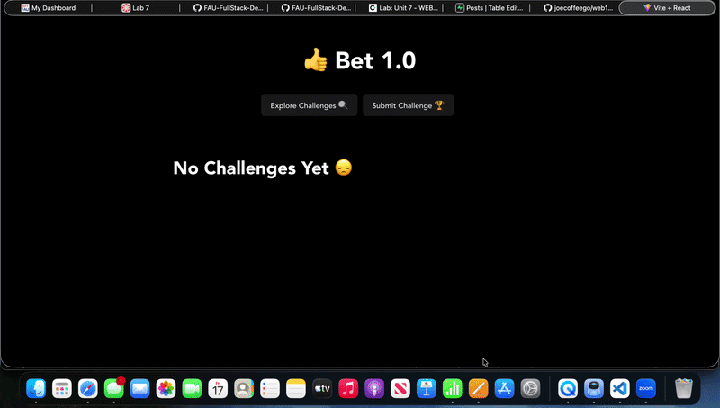

# Web Development Lab 7 - *Bet*

Submitted by: **Joseph Landers**
Znumber: Z23455968

This web app: **React and Supabase, users take challenges by clicking Bet button**

Time spent: **4** hours spent in total

## Required Features

The following **required** functionality is completed:

[x] All submitted challenges can be read on the homepage
[x] A create form allows users to submit a new challenge
[x] A challenge can be updated once it has been submitted
[x] A challenge can be deleted once it has been submitted page

The following **optional** features are implemented:

[ ] The site displays the total number of users who have indicated they have accepted each challenge

The following **additional** features are implemented:

## Video Walkthrough

Here's a walkthrough of implemented user stories:

GIF created with ...  

ezgif.com

## Notes

in this ab i learned how to link react to a backend database using supabase. implementing CRUD functionality which included creating, reading, updating, and deleteing posts. i gain knowledge on how asynchronous funcitons work with API calls and state updates affect the UI in react. 

## License

    Copyright [2026] [joseph landers]

    Licensed under the Apache License, Version 2.0 (the "License");
    you may not use this file except in compliance with the License.
    You may obtain a copy of the License at

        http://www.apache.org/licenses/LICENSE-2.0

    Unless required by applicable law or agreed to in writing, software
    distributed under the License is distributed on an "AS IS" BASIS,
    WITHOUT WARRANTIES OR CONDITIONS OF ANY KIND, either express or implied.
    See the License for the specific language governing permissions and
    limitations under the License.